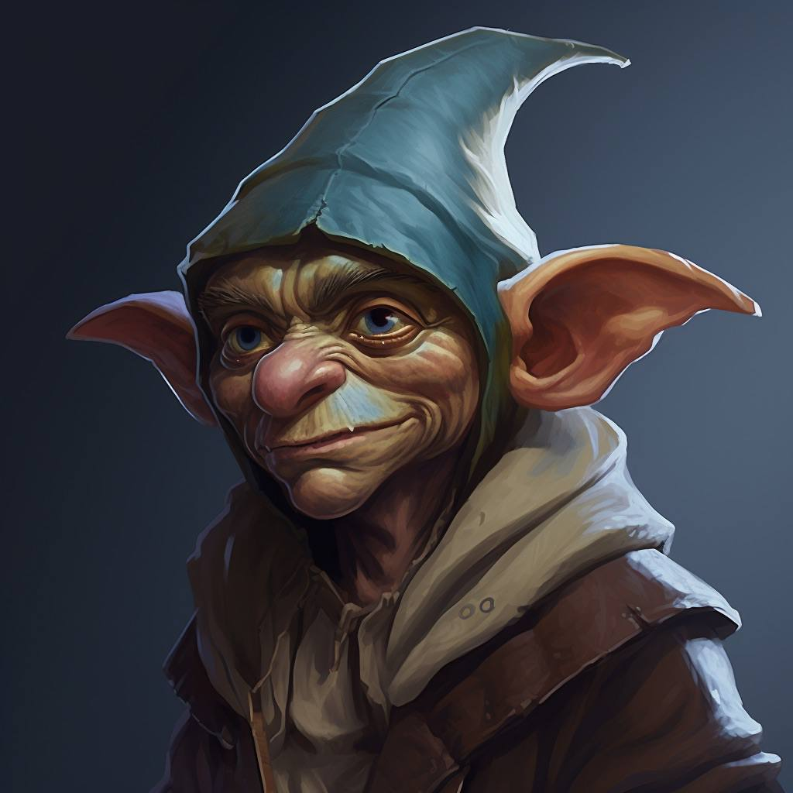

# Grimbold Description

**Race:** Half-gnome, half-goblin

**Age:** Mid 30s

**Height:** ~3’7”

**Build:** Short, wiry, slightly hunched; small but sturdy frame

**Face & Hair:**

Broad goblin ears that angle outward. Rounded gnomish nose (a bit bulbous and red-tinted). Weathered skin, earthy tone with a few wrinkles. Thick gray-brown beard, unkempt and mid-length. Bushy eyebrows.

**Clothing & Colors:**

Long, loose robes in brown and tan with cobalt-blue accents. Some glowing runes in magic effect color.

**Hat / Hood:**

A floppy cross between a gnome’s cap and a wizard’s hat, same color scheme, covered in faint glowing runes.
