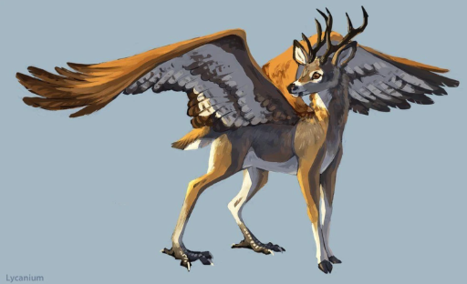

# Juniper Description

Juniper is Tomis's mount — a peryton, winged and antlered, bearing the party through the Parchwood Timberlands and into the Alabaster Sierras when ground travel will not serve.

